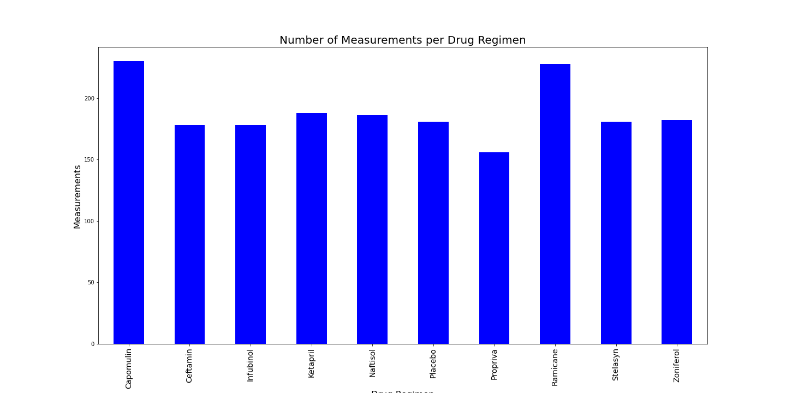
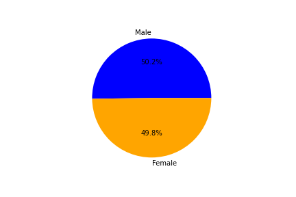
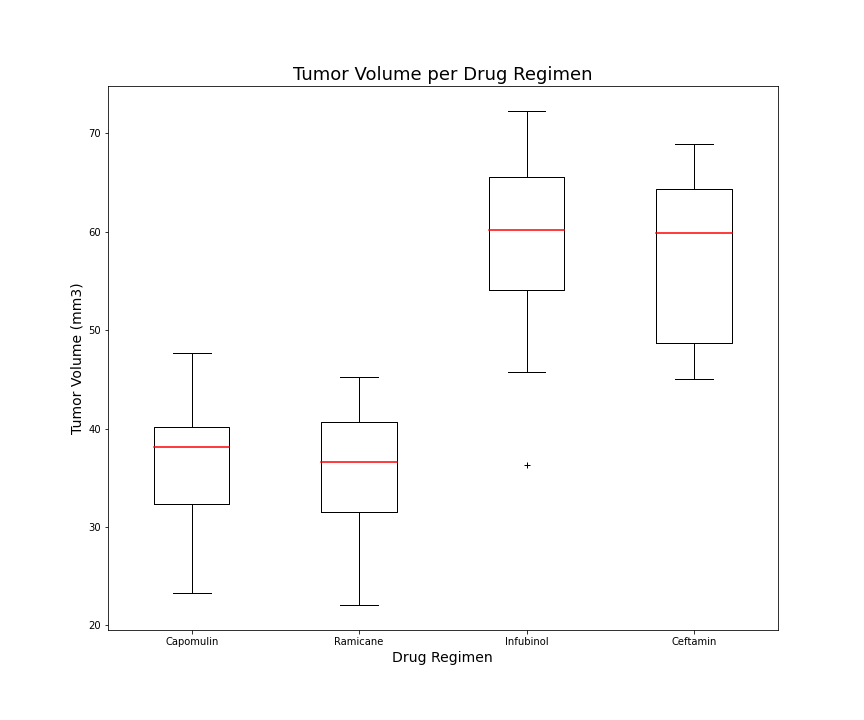
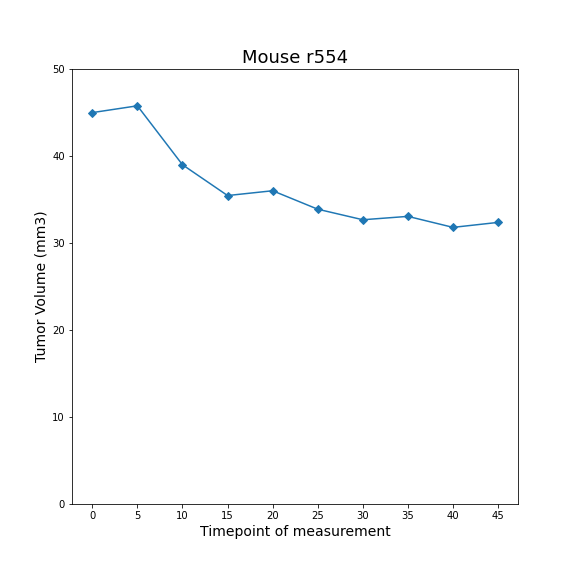
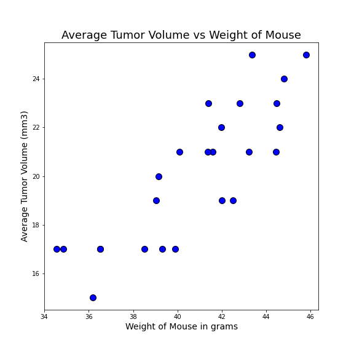
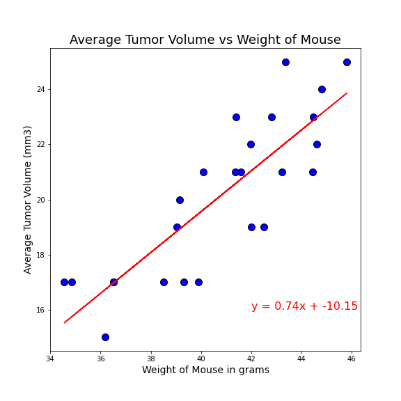

# Pymaceuticals Review

## Summary
This data analysis consists of results from a study of mice with tumors and the effect of different drug regimens on the volume of the tumors. The orignal data is saved in csv form in data directory. The data about each test subject is in mouse_metadata.csv and the results of the study is in Study_results.csv. You should be one directory ahead of the data directory in order to run the code correctly. You can find the code by clicking [here](Pymaceutical.ipynb).

## Data analysis

The first part of the analysis was running a statistics summary on tumor volume across all drug regimens. The summary is pictured below.

The second part compared creating a pie chart and a bar chart through matplotlib.pyplot and through the use of pandas. The result was identical charts.

The next part included analyzing the data quantitavely with box and whisker plots, and qualitatively by calculating the quartiles, IQR and outliers.

The next section included comparing tumor volume measurements from one mouse that was being treated by Capomulin.

The final section measured the correlation between the average tumor volume and the weight of the subject. Two charts were created, a scatter chart to show the data and the same scatter chart with the line regression.

_You can also find these images in the Image directory_

## Obervations based on data analyzed
Three observations can be found at beginning of the final code. Feel free to run your own simulations and discover more conclusions.